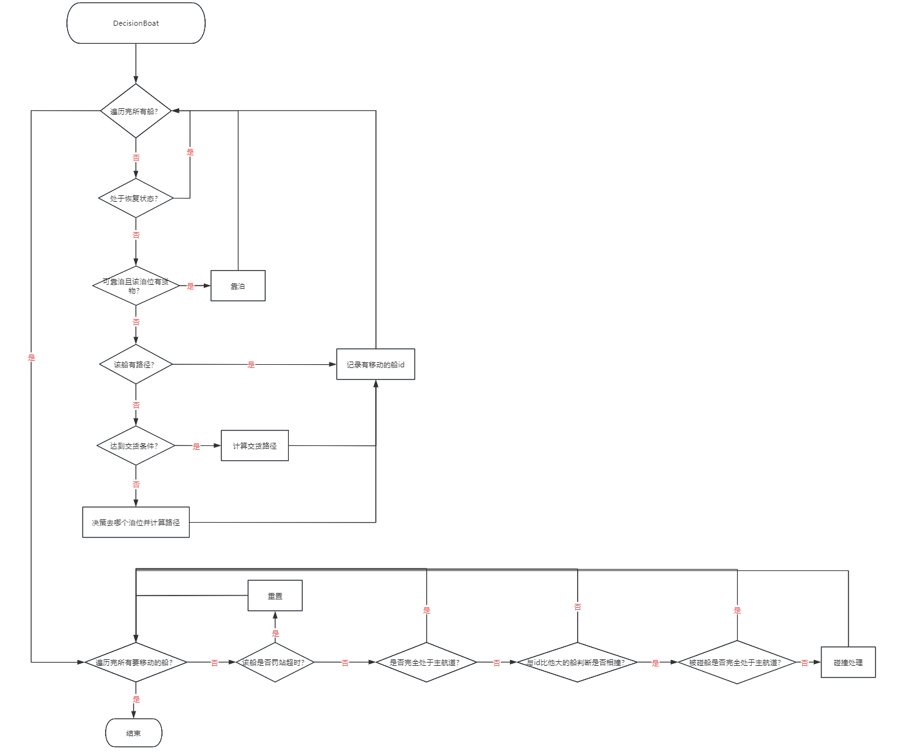

# 2024年华为软件精英挑战赛
## 1 问题背景
在智能港口领域，如何规划多机器人的任务执行以实现最优调度，如何控制泊位和机器人的配合实现最高运输价值等都是非常有价值的算法难题。本次比赛通过软件模拟了智能港口的状态信息，由选手来挑战这些有价值的算法难题。 
## 2 目录结构
.  
├── debug // 调试信息 需要建立该目录才能运行调试模式  
├── doc  // 地图信息、参考文献、任务书  
├── gasa  // 遗传、退火算法  
│$\qquad$├── data  
│$\qquad$├── include  
│$\qquad$├── money  
│$\qquad$└── src  
├── include  // 头文件  
├── replay  // 录像文件  
├── res  // 报告用的图  
├── src  // 源文件  
└── test  // 测试文件

PreliminaryJudge // 初赛判题器  
SemiFinalJudge // 复赛判题器  
CodeCraft_2024_Replayer_v2.exe // 复赛播放器  

## 3 程序架构
**类图和流程图都是设计过程中画的，以程序最终版本为准**
### 3.1 初赛
### 3.1.1 类图

### 3.1.2 流程图

### 3.2 复赛
### 3.2.1 类图

### 3.2.2 流程图

## 4 模型优势
### 4.1 A*寻路算法
参考[A*实现](https://www.redblobgames.com/pathfinding/a-star/implementation.html)，结合问题实际，对其进行了优化：cost_so_far原本使用unordered_map，每次查找是否访问过的节点，需要调用find方法，耗时较大，利用散列的方式**以O(1)查询**，显著提高了查询速度。但是散列函数构造得比较暴力，为了0冲突，浪费了挺多空间的。  
由于问题中机器人目标并不是唯一的，即虽然初步决策了一个目标，但是在寻路中发现了更好的目标，可以**提前剪枝**改变目标，以提高运算速率。  
船的A* 寻路算法对Location类进行了扩充，适配了船体的直行、逆时针旋转、顺时针旋转等变化，并增加船体方向成员属性，在A* 寻路时可以直接调用其接口**立马从current得到新的位置next**，同时修改了启发式函数以在解决该问题中以最少的耗时获取较优路线。

### 4.2 机器人碰撞处理
利用了`NextPoint`类，来管理机器人下一步走哪儿，这样将机器人碰撞问题对象从机器人变成了**落点**，由该点来“挑选”机器人走这里，从而解决了机器人竞争发生碰撞的问题。但是这种方法面临了两种问题：  
1. 面对面死锁碰撞。即A机器人要走B机器人的位置，B机器人要走A机器人的位置，对于这种问题进行了单独的“死锁处理”。两两遍历所有要移动的机器人，看是否存在死锁碰撞，若存在让优先级低的机器人给优先级高的机器人让位。
2. 不动的机器人没有`NextPoint`。解决办法是将不动的机器人都存下来，然后判断是否挡路了，如果挡路了就让路。  

由于让路的过程可能会不断递归下去，即B为A让路，C又要为B再让路依次下去，情况非常复杂，但是这种情况属于**小概率事件**，所以我们的解决方案是让路时，只考虑不会影响到任何情况的让路，即机器人让路后新位置不会对其他机器人造成影响。如果不存在这种让路，就让两个机器人都选择不动，并且记录堵塞次数，如果达到一定次数，就重新规划路线，将堵塞的地方当作障碍。这样就能在**大多数情况下让位**，**并保证在小概率事件发生时也可以解决堵塞**的问题。

让位的**位置选择**也是本模型的亮点，即假定机器人下一步会继续该方向的行走，让位机器人选择该让位方向的优先级是最低的，以避免多次让位。举个例子就是A机器人往右走，B机器人挡住了A的路，B机器人让位时最后考虑往右让位，以避免A机器人下次还是往右走，B机器人让位后还要接着让位。

### 4.3 货物管理
由于货物是随机生成的，具有**同样的生命周期**，并且生命周期到期时要**删除**货物，机器人捡起货物时也要**删除**货物。想要删除达到O(1)，我们首先选择的就是链表结构，结合货物按生命排序，新生成的货物往表尾添加，到期的货物从表头开始删除，我们最终选择了**双向链表结构**，只需要一个头指针，就可以**在O(1)的时间复杂度处理新生成的货物**。并且从头节点开始往后处理到期的货物，遇到第一个没到期的货物就可以**剪枝**了。每个机器人存了选择的货物的指针，捡起来的时候也可以**在O(1)的时间复杂度删除**。

每次决策机器人选择哪个货物时，需要遍历整个货物链表，由于有些货物可能已经被别的机器人选择了，所以我们还增加了一个first_free_goods指针来指向货物链表中**第一个没有被机器人选中的货物**，这样每次选择货物时从该指针开始遍历，就**无需重复遍历**之前被其他机器人选择的货物了，节约了时间。

### 4.4 预处理
在预处理阶段

- 通过BFS，将每个目标放入队列BFS，类似于目标同时往其周围发散搜索不断更新自己的领域。从而存取了距离每个点最近的泊位id，交货点，购买点等信息，这样对于任意一点，**都可以在O(1)的时间内获取目标位置**，无需每次决策时再决策去哪里。
- 通过并查集，对每个点分区。机器人选择货物时，如果不是同一个分区就跳过，以免不可达A* 遍历整个可达域。

### 4.5 调试信息
具有大量调试信息，调试信息采用无缓冲方式写入文件，并利用宏控制，多次帮助我们**快速定位bug**。  
调试模式中，统计了很多**数据**，以**辅助**我们更改策略、优化策略、修改参数等。

### 4.6 测试文件
模型中耗时主要是A* 的运算，A* 的耗时主要是遍历了哪些点，我们的测试程序将这些点画在了地图中，以便我们**改进启发式函数**，从而为优化A* 铺路。  
同时，也有画路径的版本，为出现路径问题时**查询问题**原因提供了很好的依据。

## 5 经验总结

>陈宁杰:  
临近初赛正式赛几天的时候觉得当时的版本已经没什么好优化的了，根本想不到的优化方向，有点儿“江郎才尽”的感觉，最终得分位于第二梯队，与第一梯队始终有差距。结果复赛的时候对初赛的很多策略都进行了优化，程序得分蹭蹭往上涨。  
得出的结论就是：**明确**优化目标，越**精确**越好。  
例如，整个程序都以挣钱(得分)为目标，而初赛时我们机器人选择货物是以距离为评判标准，船选择泊位是以泊位累计的货物数量为评判标准。这些评判都是“间接”性地优化目标，并不是“直接”优化，后来策略改成单位距离金钱获得量后得分得到了巨大提升。  
复赛前夜，得分突破39w位居第三，距离第二几十分，甩了第四挺多的。本自信满满地觉得复赛希望很大，结果复赛失利。失败经验总结如下：  
复赛当天新增一种机器人，可以装两个货物但是价格为5k，原来的机器人价格为2k。我以为要考察短时间编程的能力，直接开始修改程序以适配新增的机器人，编写完之后距离比赛结束只剩下1个小时，然后开始疯狂调参，结果分数怎么都不高，因为只要用了这种新机器人，就是负优化，当时并没有**冷静**到可以正确分析收益，对于这个机器人的参数始终没有往0调。调参也毫无章法，没找到规律纯粹乱调碰运气。最终非常遗憾，并没有把原本程序的得分能力展现出来。

---
